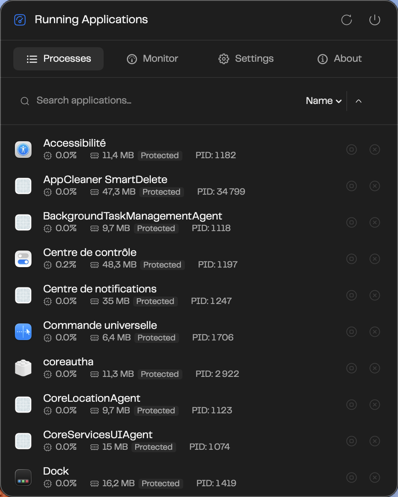
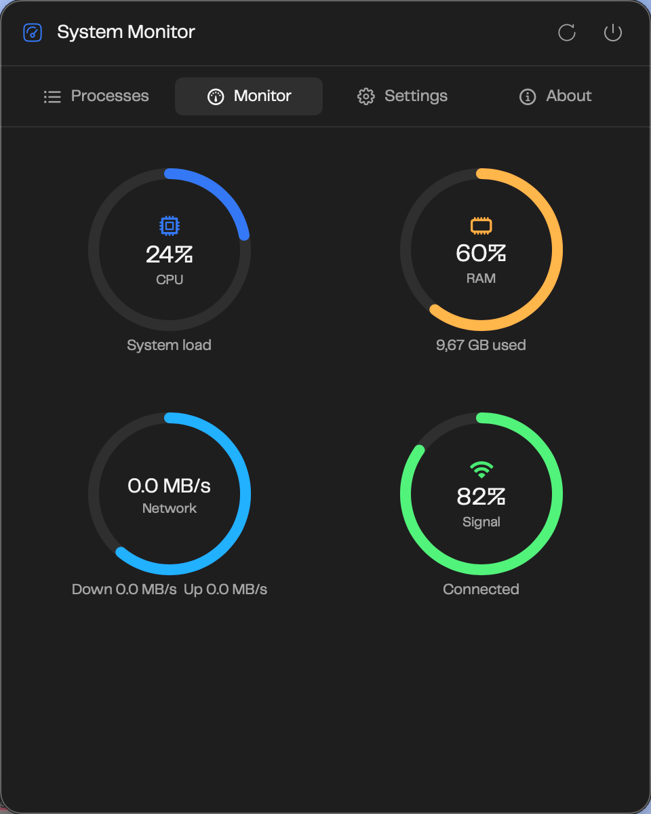

# PulseBar

PulseBar is a macOS menu bar app for keeping an eye on running applications and basic system activity. It is a modified version of the original MIT-licensed MissionBar project.

<p align="center">
  
</p>

## Features

- Processes tab: running applications, app icons, PID, CPU usage, resident memory usage, search, and sorting.
- Guarded quit actions: quit or force quit user applications while protecting PulseBar, Apple apps, and system agents.
- Monitor tab: CPU, memory, network throughput, and connection quality cards.
- Settings tab: Open at login using Apple's `SMAppService` when the app is built with a real Apple signing identity.
- About tab: current version, source link, upstream project link, and MIT license link.

<p align="center">
  
</p>

## Refresh Cadence

- Running processes refresh every 5 seconds.
- Global monitor metrics refresh every 1 second.
- The toolbar refresh button updates both views immediately.

## Requirements

- macOS 15.0 or later
- Xcode 16 or later
- Apple Silicon or Intel Mac

## Build From Source

```bash
git clone https://github.com/DailyXplorer/PulseBar.git
cd PulseBar
open PulseBar.xcodeproj
```

Build and run the `PulseBar` scheme from Xcode, or build from the command line:

```bash
xcodebuild -project PulseBar.xcodeproj -scheme PulseBar -destination 'platform=macOS,arch=arm64' build
```

## Local Signed Install

Open at login requires PulseBar to be signed with a real Apple signing identity. The default command-line build stays ad-hoc so the project remains easy to clone and build, but you can install a signed local copy once Xcode has your Apple account and Development Team configured:

```bash
DEVELOPMENT_TEAM=YOURTEAMID ./script/install_signed_local.sh
```

If your keychain only has one Apple signing identity, the script can usually detect the Team ID automatically:

```bash
./script/install_signed_local.sh
```

For repeated local installs, you can create an ignored `.pulsebar-signing.env` file:

```bash
DEVELOPMENT_TEAM=YOURTEAMID
```

You can also open `PulseBar.xcodeproj`, select the `PulseBar` target, set your Development Team in Signing & Capabilities, then build and copy the app to `/Applications`.

No prebuilt release binary is published yet. A downloadable app should wait until there is a proper Developer ID signing and notarization flow.

## Development

The repository includes `script/build_and_run.sh` for local agent-driven development:

```bash
./script/build_and_run.sh --verify
```

The project keeps Hardened Runtime enabled and does not use App Sandbox, because PulseBar needs to request quit and force quit actions for other user applications in a direct-download macOS distribution.

## Attribution

PulseBar is based on [Softal-io/MissionBar](https://github.com/Softal-io/MissionBar), created by Ram Patra and released under the MIT License.

Original copyright remains with Ram Patra. PulseBar modifications are maintained by DailyXplorer. See [NOTICE.md](NOTICE.md) and [LICENSE](LICENSE).

## Support

Please use GitHub Issues for bugs and feature requests:

https://github.com/DailyXplorer/PulseBar/issues
